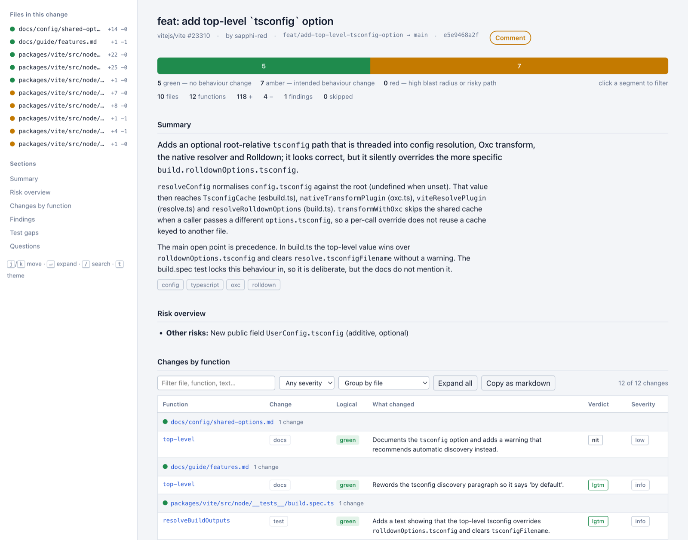

# pr-ism

A Claude skill that reviews a pull request function by function and produces an interactive HTML report.

Anthropic's reviewers tell you what's wrong; pr-ism shows you what changed and where the risk is.
With the optional [pr-review-toolkit](https://github.com/anthropics/claude-plugins-public/tree/main/plugins/pr-review-toolkit) plugin
installed, pr-ism puts its review map on top of Anthropic's reviewers.



## Usage

In Claude Code the plugin command is `/pr-ism:pr-ism`. The examples below use the short `/pr-ism` form,
which works when the skill is installed without the plugin (manual copy or `npx skills`).

```
/pr-ism https://github.com/o/r/pull/123   # GitHub PR
/pr-ism #123                              # PR in the current repo
/pr-ism https://gitlab.com/g/p/-/merge_requests/7
/pr-ism feature/foo                       # branch vs default branch
/pr-ism main..HEAD                        # commit range
/pr-ism change.patch                      # patch file
/pr-ism config                            # customise output
```

The report is built around how experienced reviewers read a change (the reasoning is in
[docs/report-v2-design.md](docs/report-v2-design.md)):

- **Decide strip**: verdict, the one reason, and "start here" — the load-bearing rows and the worst findings, linked
- **Shape strip**: one tile per directory, sized by lines changed and coloured 🟢 no behaviour change / 🟡 intended change / 🔴 high blast radius; click to filter
- **Review path**: the function-level table ordered ① load-bearing ② blockers ③ red paths judged ok ④ tests ⑤ everything else, each with a time estimate at 400 lines an hour; tick rows as you go
- **Rows**: file, function, shape (diff bar, +/−, findings badge, tests tick), change type, rating, what changed, verdict, severity; expand for the attached findings and the diff
- **Findings** with Agree / Not an issue / Fixed, **test gaps**, **questions for the author**; *Copy decisions* hands your verdicts back to Claude for posting

After the review, Claude prints a 12-line card with clickable `file:line` links. Then say `walk` for a guided pass
station by station, `show 3` to see one diff, `fix 1` to have finding 1 fixed (applied only after you say yes), or `post`.

Markdown output is also available (`output.format`).

After a review, pr-ism can post it to the PR as inline comments. It shows a dry run first and posts only when you say yes.
Running it again on the same PR after new commits reviews only what changed since the last run.

## How a review works

1. **Fetch**: the diff and PR metadata come from `gh`, `glab`, the REST API, a local branch, a range or a patch file.
2. **Parse**: every hunk is split into per-function segments with line ranges and links, and red paths and missing tests are flagged.
3. **Detect**: Claude reads each change and writes one row per function, with what changed, the change type, a green/amber/red rating, a verdict and a severity.
   In Claude Code with pr-review-toolkit installed, its agents run in parallel at the same time: code-reviewer always, and silent-failure-hunter, pr-test-analyzer, type-design-analyzer or comment-analyzer when the diff touches their area.
4. **Merge**: agent findings are attached to the row whose function contains them. Duplicates and low-confidence findings are dropped, and a row's severity goes up when a finding is worse. Each finding keeps its source.
5. **Render**: the result is one self-contained HTML report. When findings come from more than one source, each is labelled and you can filter by source.
6. **Post** (optional): the review goes back to the PR as inline comments.

`review.engine` picks the detector: `auto` (default) uses the toolkit when it is available and pr-ism's own rubric otherwise.
`prism` always uses the rubric, and `toolkit` requires the plugin.
The toolkit is never required. claude.ai has no subagents, so it always uses the rubric.

## Install

**Claude Code plugin**
```
/plugin marketplace add 31mahadi/pr-ism
/plugin install pr-ism@pr-ism
/reload-plugins
```
Adding the marketplace only lists the plugin; the `install` line is what adds the command.
Then run `/pr-ism:pr-ism <ref>` in any repo.

**Optional: Anthropic's reviewers as the detection engine**
```
/plugin install pr-review-toolkit@claude-plugins-official
/reload-plugins
```
With both installed, pr-ism uses the toolkit's agents automatically (`review.engine: auto`).
Check that it's active: `/pr-review-toolkit:review-pr` should appear in the slash menu.

**Other agents (Codex, Cursor, OpenCode and more)**: `npx skills add 31mahadi/pr-ism` (add `-g` for all projects).

**Manual**: copy `skills/pr-ism` into `~/.claude/skills/` or `<project>/.claude/skills/`.

**claude.ai / Claude Desktop**: upload `pr-ism.skill.zip` from the [latest release](https://github.com/31mahadi/pr-ism/releases/latest) under *Settings → Skills*.

**Requirements**: `python3` 3.9+ and `git`. GitHub PRs need `gh`, or `GITHUB_TOKEN` for the REST API. GitLab MRs need `glab`. Posting comments uses the same CLI; GitLab gets one summary note, not inline comments.

**Update**: `claude plugin marketplace update pr-ism && claude plugin update pr-ism@pr-ism`, then `/reload-plugins`.

### Troubleshooting

| Symptom | Fix |
|---|---|
| `/pr-ism` isn't in the slash menu | Type `/pr-ism:pr-ism`. If it's still missing, check `claude plugin list`: the marketplace may be added but the plugin not installed. Run `/plugin install pr-ism@pr-ism`, then `/reload-plugins`. |
| `pr-review-toolkit not found in marketplace` or `Invalid schema … displayName` | Your Claude Code is too old for the current official marketplace. Upgrade it (`brew upgrade --cask claude-code` or `npm i -g @anthropic-ai/claude-code`), then run `claude plugin marketplace update claude-plugins-official` and install again. |
| The report says the rubric was used even though the toolkit is installed | The session started before the install. Open a new session or run `/reload-plugins`. To force the toolkit, run `/pr-ism:pr-ism config set review.engine toolkit`; the review then stops with a clear error if the toolkit is unavailable. |
| Changes to a local checkout don't show up | The plugin runs from its install cache, not your checkout. Test local changes with `claude --plugin-dir /path/to/pr-ism`. |

## Configure

```
/pr-ism config set report.group_by severity
/pr-ism config set review.red_paths "**/billing/**" --global
/pr-ism config reset
/pr-ism config set review.engine prism     # rubric only, even with the toolkit installed
```

Settings are layered, and later layers win: built-in defaults, then `~/.pr-ism/config.json`, then `<repo>/.pr-ism/config.json`.
All keys are listed in [config-reference.md](skills/pr-ism/references/config-reference.md).

Review files are written to `<repo>/.pr-ism/`. Add `.pr-ism/work/` and `.pr-ism/reviews/` to your `.gitignore`.

## Ratings

- **Logical** (green / amber / red): how far-reaching the change is, not whether it is correct.
- **Severity**: the worst problem found in a row.
- **Verdict**: `lgtm`, `nit`, `question`, `needs-changes` or `blocking`.

## Limits

- Function names are detected for most major languages. For others, Claude reads the file and names the function itself.
- Binary files are flagged but not reviewed. Lockfiles, build output and vendored code are skipped (`review.ignore`).
- The GitHub REST API caps a diff at about 300 files. For larger PRs, use `gh` or review the local branch.

## Development

```
python3 tests/smoke_test.py            # must print "all good"
uvx ruff check skills tests            # lint (config in pyproject.toml)
uvx ruff format skills tests           # format
```

To release:

1. Bump the version in `skills/pr-ism/SKILL.md`, `.claude-plugin/plugin.json` and `.claude-plugin/marketplace.json`.
2. Add an entry to `CHANGELOG.md`.
3. Tag the commit: `git tag vX.Y.Z && git push origin vX.Y.Z`.

CI then builds `pr-ism.skill.zip` and attaches it to the release.

## License

MIT. See [LICENSE](LICENSE).
